# syncert.github.io/population_prediction_platform_capstone

# Professional Self-Assessment

Completing my computer science degree and building my ePortfolio has allowed me to demonstrate not only technical ability but also the professional skills that make those abilities meaningful in real-world contexts. Over the past several years, I have grown from a data analyst focused on descriptive reporting into a computer science professional able to design software systems, develop predictive algorithms, and build secure, scalable applications.

Collaboration has been central to that journey. Many of the course projects required picking up incomplete or unfamiliar codebases, debugging them, and extending them under tight timelines. That experience mirrors industry work, where teamwork often means inheriting and improving systems rather than starting from scratch. In my capstone project—the Population Prediction Platform—I extended this idea by containerizing the application and deploying it as a web-based tool so that diverse audiences could access forecasts and contribute feedback.

I have also grown in my ability to communicate with stakeholders. Throughout the program, I learned how to translate technical complexity into clear visuals, narratives, and recommendations. In the capstone, React and Chart.js dashboards transform model metrics into accessible insights, showing not just predictions but also the trade-offs between models. This approach reflects my broader professional value: technical solutions only create impact when they are communicated effectively and transparently.

My work in algorithms and data structures began with reinforcement learning but expanded into regression, time-series forecasting. Alongside this, I practiced making design trade-offs—choosing between accuracy, scalability, and performance—while applying efficient data processing with Pandas and Polars. These skills demonstrate the ability to balance theory with practical implementation.

In software engineering and databases, I designed and deployed a normalized PostgreSQL schema, developed ETL pipelines to ingest Census/BLS/FRED data, and exposed that data through a secure FastAPI service. These artifacts show my ability to structure and manage large-scale data pipelines while maintaining performance and reproducibility. Security was a continuous thread, from authentication and container hardening to considering risks like adversarial data poisoning in machine learning workflows.

Taken together, the artifacts in my ePortfolio tell a cohesive story. The algorithmic work highlights my foundation in predictive modeling. The database enhancements illustrate my ability to manage and optimize large datasets. The full-stack application demonstrates how I can integrate these skills into a complete, secure, and professional product.

Most importantly, the program has helped shape my professional goals. I now target roles such as Analytics Engineer or Data Scientist—positions that combine data science and software engineering to deliver impactful solutions. The portfolio reflects my commitment to building systems that are collaborative, transparent, and secure, and it shows my readiness to contribute to organizations at the intersection of analytics and engineering.


# Population Prediction Platform (CS 499 Capstone Project)

## 📖 Project Overview
This project builds on my artifact from **CS 370 – Emerging Trends in Computer Science**, where I implemented a Q-learning algorithm to solve a treasure maze. The capstone transforms that prototype into a **full-fledged Population Prediction Platform**, combining **software engineering, predictive algorithms, and database design**.  

The platform forecasts U.S. population trends using multiple algorithms, provides professional-quality visualizations **web deployment** (via React). It integrates with the U.S. Census API and leverages modern data engineering and machine learning practices.

# 📷 Screenshots:
- UI
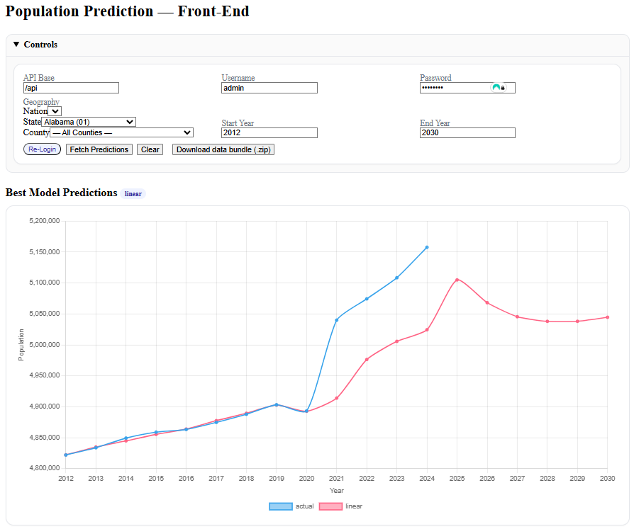
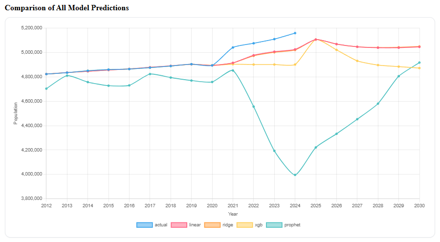
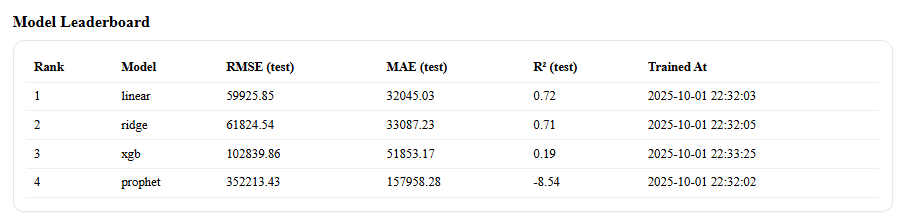
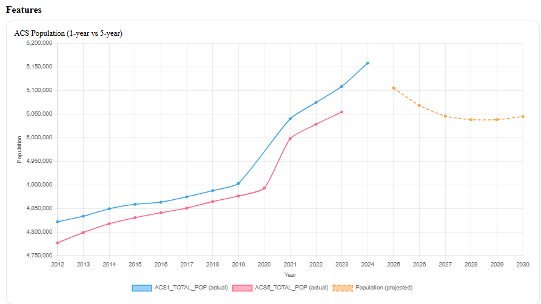
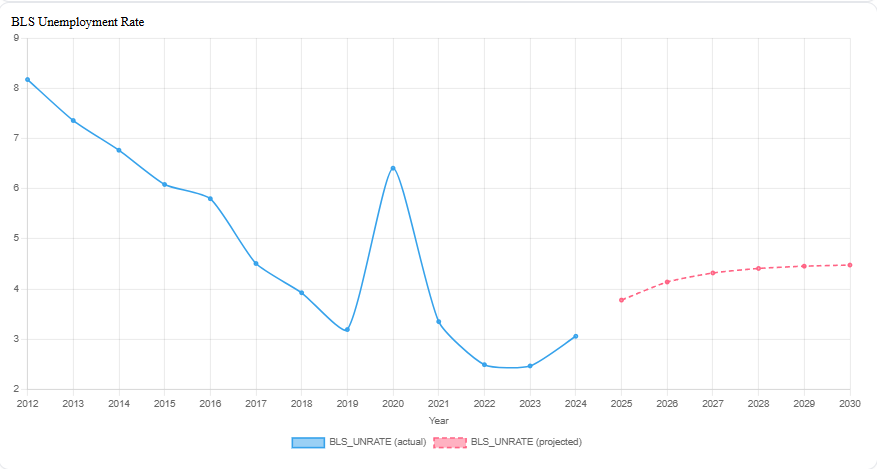
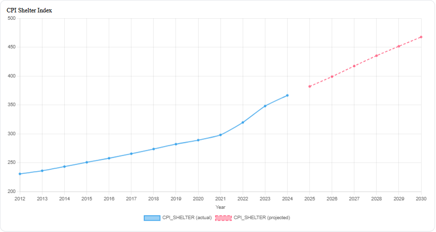
- FastAPI Documentation
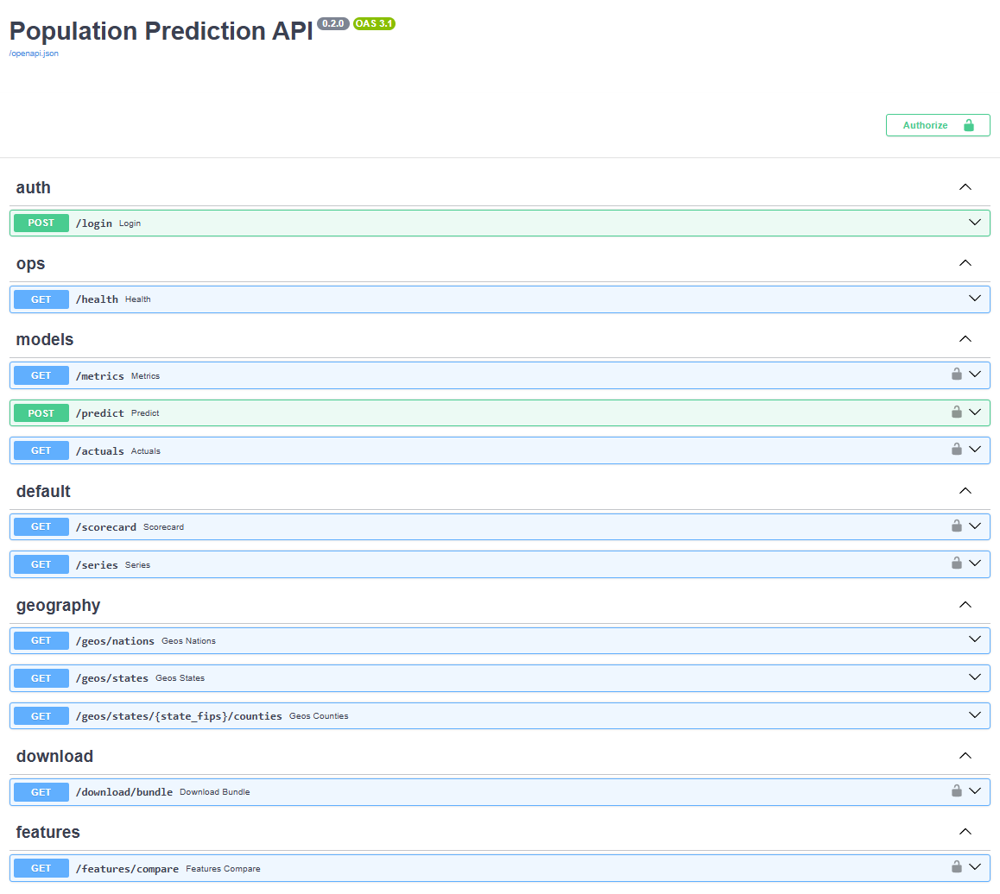
---

## 🎯 Goals
- **Software Engineering & Design**  
  Transform the original Jupyter notebook prototype into a containerized, scalable application available via web and desktop.

- **Algorithms & Data Structures**  
  Expand beyond Q-learning to incorporate **Linear Regression, Time Series Forecasting (Prophet)**, and **Deep Q-Learning** for predictive modeling.

- **Databases**  
  Upgrade from local data objects to a **PostgreSQL relational database** with ETL pipelines (Polars/Pandas), ensuring clean, validated, and query-efficient population data.

---

## 🗂️ Artifact Enhancements by Category

## 📹 Code Review (Video)
[](https://youtu.be/1Ghb1E5JotU)

### 1. Software Engineering & Design
- **Enhancement**: Build a containerized web application with interactive charts (React + Chart.js).  
- **Outcomes Demonstrated**:  
  - Collaborative environments (Docker deployment).  
  - Professional-quality visuals (React front-end).  
  - Secure architecture (auth, hardened containers).  

### 2. Algorithms & Data Structures
- **Enhancement**: Implement multiple predictive algorithms and evaluate performance trade-offs.  
- **Outcomes Demonstrated**:  
  - Algorithmic design and evaluation.  
  - Use of innovative libraries (Scikit-Learn, Prophet, PyTorch).  
  - Communication of trade-offs (accuracy vs. efficiency).  

### 3. Databases
- **Enhancement**: Develop a relational database schema, load Census data via ETL, and integrate with API + models.  
- **Outcomes Demonstrated**:  
  - Normalized schema with indexes for performance.  
  - SQLAlchemy ORM integration.  
  - Security practices (RBAC, query sanitization).  

---

## 🧩 Course Outcomes Alignment
This project demonstrates all five CS 499 outcomes:

1. **Collaboration** – Containerization + shared database enables team use.  
2. **Communication** – React/Chart.js visualizations present results clearly.  
3. **Computing Solutions** – Balances trade-offs across algorithms and architectures.  
4. **Innovative Tools** – Modern ML, ETL, and container frameworks.  
5. **Security Mindset** – Authentication, container hardening, role-based DB access.  

---

## 📊 System Design Visualization

This section presents the three key architecture views that support the platform design.  
Each visualization highlights a different perspective of the system.

---

### 🛠️ From CS-370 Prototype to Capstone
Planned enhancements that extend the original Q-learning artifact into a full platform.

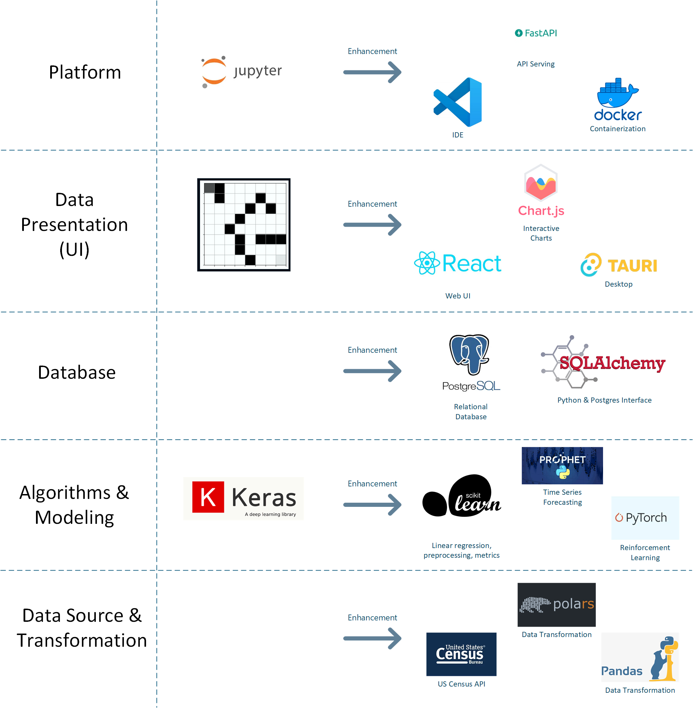

---

### 🏗️ System Architecture
High-level view of external data sources, ETL, storage, training, API, and UI layers.

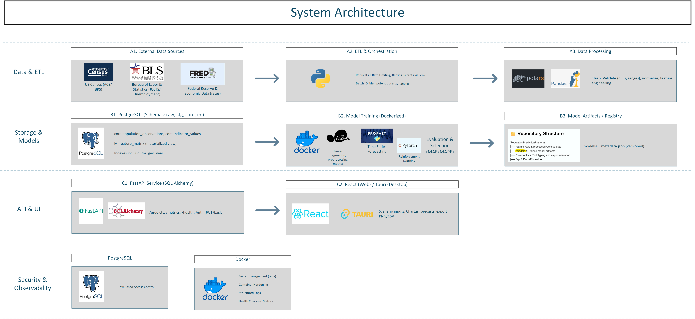

---

### 🔄 Request → Predict → Visualize
Sequence of interactions from user input to prediction to chart rendering.

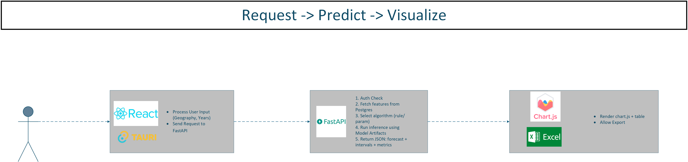

---

### 📈 ETL Training Loop
Data ingestion, staging, feature matrix refresh, and model training flow.

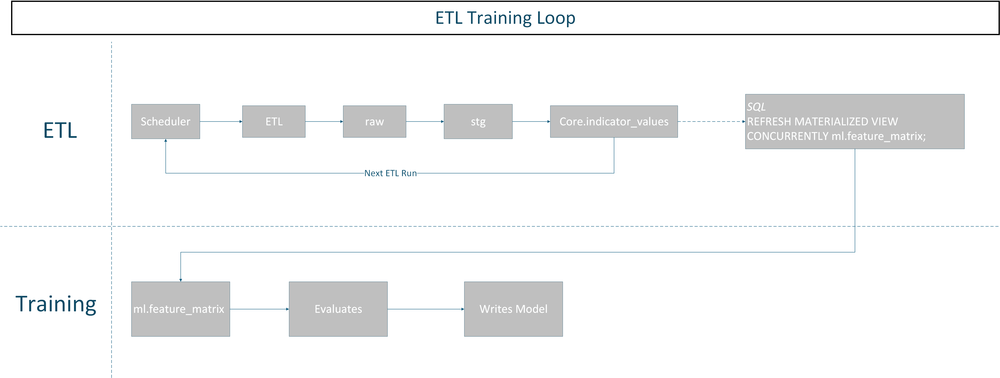

---

👉 [Download the full Capstone Design Document (PDF)](artifacts/images/Capstone_Design_Document.pdf)

---

## 🚀 Roadmap
This project will be completed over **6 weeks**, with deliverables including:
1. Environment setup & ETL pipeline.  
2. PostgreSQL schema + data ingestion.  
3. Predictive algorithms (linear regression, forecasting, deep Q-learning).  
4. FastAPI back-end with authentication.  
5. React front-end with charts.  
6. Final containerized stack, documentation, and presentation.  

---

## 📂 Repository Structure
```plaintext
/PopulationPredictionPlatform
├── models/       # Trained model artifacts (.pkl and .json for prophet)
├── notebooks/    # Prototyping and experimentation
├── api/          # FastAPI service
├── ui/           # React + Tauri front-end
├── db/           # Postgres schema + migrations
├── etl/          # ETL scripts (Python jobs, pipelines)
├── src/          # ETL scripts (Python jobs, pipelines)
│   └── ppp_api/    # storage of code for api
│   └── ppp_common/ # storage of code for common-use across platform
│   └── ppp_etl/    # storage of all etl scripts
│   └── ppp_ml/    # storage of all ml scripts
├── artifacts/    # Documentation and original .ipynb file
│   └── images/   # Exported diagrams and figures
├── docker-compose.yml
├── .env_example
├── Makefile
└── pyproject.toml

```

---

# 📦 Data Sources & Indicators

## ACS — American Community Survey (Census)

**What it is**  
Annual survey from the U.S. Census Bureau, with two releases:

- **ACS1 (1-year):** Timelier; available for geographies with population ≥ 65k (nation, states, large counties/places).
- **ACS5 (5-year):** Pooled over 5 years; covers all standard geographies (nation, states, all counties, many places).

**What we load**

- **Total population (`B01001_001E`):**
  - Indicator mirrors: `ACS1_TOTAL_POP`, `ACS5_TOTAL_POP` in `core.indicator_values` *(unit: count, source: ACS)*  
  - Canonical facts: one population per `(geo_code, year)` in `core.population_observations`

**Rule of thumb**

- Use **ACS1** for nation/states (more current).
- Use **ACS5** for counties (universal coverage).

**Geography keys**

- Nation: `US`
- States: 2-digit FIPS
- Counties: 5-digit FIPS

**Why it matters**  
ACS establishes the baseline population by geography and time, anchoring the forecasting models.

---

## BLS — Local Area Unemployment Statistics (LAUS) (States & Counties)

**What it is**  
Labor force statistics for states and counties from the Bureau of Labor Statistics.

**What we load**

- **Unemployment rate (annual average, percent):** `BLS_UNRATE` in `core.indicator_values` *(unit: percent, source: BLS)*

**Series ID patterns & examples**

- **State (seasonally adjusted, annual avg):** `LASST{SS}…003`  
  Example (CA): `LASST060000000000003`
- **County (not seasonally adjusted, annual avg):** `LAUCN{SS}{CCC}…0003`  
  Example (Los Angeles County, CA): `LAUCN060370000000003`

> Notes  
> • Annual values prefer BLS’s **M13** (annual average) observations; if absent, we compute the calendar-year mean of monthly points.  
> • Coverage begins in **2009** to align with ACS availability used elsewhere.

**Why it matters**  
Unemployment reflects economic opportunity, a key driver of migration and regional population change.

---

## BLS — CPS Headline Unemployment (Nation)

**What it is**  
The national unemployment rate from the Current Population Survey (CPS), via the BLS API.

**What we load**

- **Unemployment rate (U.S.)** (seasonally adjusted, annualized): `BLS_UNRATE` with `geo_code='US'`  
  Series: `LNS14000000` (SA monthly → calendar-year mean) *(unit: percent, source: BLS)*

**Why it matters**  
Provides national coverage to complement LAUS state/county series, ensuring all three levels (US/state/county) are populated for modeling.

---

## FRED — CPI Shelter Index (U.S. + Census Regions)

**What it is**  
CPI sub-index for **Shelter**, sourced from BLS and distributed via FRED. We load **U.S.** and the **four Census regions**, then annualize.

**What we load**

- **Shelter CPI (NSA monthly → annual mean):** stored as `CPI_SHELTER` in `core.indicator_values` *(unit: index (1982–84=100), source: FRED)*
  - **U.S.:** `CUUR0000SAH1` → `geo_code='US'`
  - **Northeast:** `CUUR0100SAH1` → `geo_code='R1'`
  - **Midwest:** `CUUR0200SAH1` → `geo_code='R2'`
  - **South:** `CUUR0300SAH1` → `geo_code='R3'`
  - **West:** `CUUR0400SAH1` → `geo_code='R4'`

> Notes  
> • We use **NSA** (`CUUR…`) series and compute calendar-year means. If you prefer seasonally adjusted inputs, swap to `CUSR…` equivalents.  
> • `core.geography` includes a `region` type for `R1–R4`.

**What Shelter CPI measures**

- **Concept:** Price of housing services consumed where people live (not a house price index).
- **Components:** Rent of primary residence, Owners’ Equivalent Rent (OER), lodging away from home (small share).
- **Not included:** Home purchase prices, mortgage rates, property taxes, transaction costs.
- **Behavior:** Lags spot market rents due to lease renewals and OER methodology.

**Why it matters**  
Housing cost pressure shapes migration and location decisions. Adding Shelter CPI introduces a cost-of-living dimension to forecasts.

---

# 🧮 Feature Matrix (`ml.feature_matrix`)

**Purpose**  
A unified view aligning population, labor market, and housing-cost signals per `(geo_code, year)` for modeling.

**Inputs**

- `core.population_observations` (canonical population)
- `core.indicator_values`:
  - `BLS_UNRATE` (US via CPS; states & counties via LAUS)
  - `CPI_SHELTER` (US + regions `R1–R4` via FRED)

**CPI fallback logic**

1. Use CPI at the **exact geo** if present.  
2. Else for **states & counties**, map the state FIPS → **region (R1–R4)** and use regional CPI.  
3. Else fall back to **US** CPI.

**Region mapping**

- **R1 Northeast:** CT(09), ME(23), MA(25), NH(33), RI(44), VT(50), NJ(34), NY(36), PA(42)  
- **R2 Midwest:** IL(17), IN(18), MI(26), OH(39), WI(55), IA(19), KS(20), MN(27), MO(29), NE(31), ND(38), SD(46)  
- **R3 South (incl. DC=11):** AL(01), AR(05), DE(10), DC(11), FL(12), GA(13), KY(21), LA(22), MD(24), MS(28), NC(37), OK(40), SC(45), TN(47), TX(48), VA(51), WV(54)  
- **R4 West:** AK(02), AZ(04), CA(06), CO(08), HI(15), ID(16), MT(30), NV(32), NM(35), OR(41), UT(49), WA(53), WY(56)

**Columns (selected)**

- `population` (level value), `pop_lag1`, `pop_lag5`, `pop_ma3` (3-yr moving avg)  
- `pop_yoy_growth_pct` (YoY % growth when `year-1` exists)  
- `pop_cagr_5yr_pct` (5-yr CAGR when `year-5` exists)  
- `unemployment_rate` (BLS)  
- `rent_cpi_index` (CPI Shelter with geo→region→US fallback)

**Geographies**

- Nation: `US`  
- Regions: `R1` (Northeast), `R2` (Midwest), `R3` (South), `R4` (West)  
- States: 2-digit FIPS  
- Counties: 5-digit FIPS

---

# 🔎 Validation Tips

**Row parity & duplicates**
```sql
select count(*) from ml.feature_matrix;

select geo_code, year, count(*) c
from ml.feature_matrix
group by 1,2
having count(*) > 1;
```

## Model families & how we pick “best”

We train four families per geo: **Prophet**, **Linear**, **Ridge**, **XGBoost**.  
Each training run writes metrics to `ml.model_metrics` and a forecast snapshot to `ml.model_forecasts`.  
A leaderboard view (`ml.model_leaderboard`) summarizes headline metrics, and the artifact pointer
`ml.model_artifacts.best_run_id` is set to the **lowest test RMSE** for that (geo, model).

### What we’ve observed on annual population
- **Linear / Ridge**: 
- **XGBoost**: 
- **Prophet**: 

### Metric definitions (test split)
- **RMSE** (lower is better): `sqrt(mean((yhat - actual)^2))`
- **MAE** (lower is better): `mean(|yhat - actual|)`
- **R²** (higher is better): `1 - SSE/SST` on test period

### How “best” is computed
We recompute “best” directly from `ml.model_metrics` (no dependency on MV freshness):
- For a given `(geo, model)`, we rank by test RMSE ascending and set `ml.model_artifacts.best_run_id` to rank 1.
- `ml.model_artifacts.latest_run_id` always points to the most recent successful run.

**Serving default:** use `best_run_id` for all read paths unless a caller explicitly asks for a specific run.


# ⚙️ Install & Run

## 1. Prerequisites
- **Docker** + **Docker Compose**
- **Make** (optional, but all commands below use the provided `Makefile`)
- **Git**
- (Optional) `curl` for quick health checks

---

## 2. Configure Environment
Copy the example environment file, rename it to `.env`, and update values for your machine:

```bash
cp .env_example .env
```

### Required Environment Variables

```ini
# --- Postgres
POSTGRES_USER=admin        #if this is updated you need to update the default api password in ui > src > PopulationDashboard.jsx
POSTGRES_PASSWORD=changeme #if this is updated you need to update the default api password in ui > src > PopulationDashboard.jsx
POSTGRES_DB=populationdb
POSTGRES_PORT=5432

# --- API
API_PORT=8000

# --- Data API Keys
CENSUS_API_KEY=INSERT_KEY                # https://api.census.gov/data/key_signup.html
BUREAU_LABOR_STATISTICS_KEY=INSERT_KEY   # https://data.bls.gov/registrationEngine/
FRED_KEY=INSERT_KEY                      # https://fred.stlouisfed.org/docs/api/api_key.html

# --- User permissions
UID=1000
GID=1000

# --- Ports (host -> container)
API_PORT=8000               # FastAPI exposed port

---

## 3. One-Shot Bootstrap (fresh DB → ETL → train → health check)
From the repo root:

```bash
make bootstrap
```

### What it does:
1. `docker compose down -v` (wipe containers & volumes)
2. `docker compose up -d --build` (build + start)
3. Waits for Postgres to accept connections
4. Runs ETL jobs (ACS, BLS, FRED)
5. Trains models (Prophet, Linear, Ridge, XGB)
6. Pings the API health endpoint

When finished (assuming default ports):
- **UI**: [http://localhost](http://localhost)
- **API**: [http://localhost:8000](http://localhost:8000)
  - /docs for documentation
  - /health for health check and models loaded

The UI talks to the API via same-origin `/api` through Nginx (no CORS headaches).

---

## 4. Useful Make Targets
```bash
make up         # Build & start (no wipe)
make down       # Stop
make clean      # Stop and wipe volumes (DB reset)
make logs       # Follow all logs
make etl-all    # Run all ETL jobs inside the API container
make train      # Train all geos/models
```

Quick API check:

```bash
curl -sf http://localhost:${API_PORT:-8000}/health && echo "API healthy ✅"
```

---

## 5. Nightly Training (Optional)
Install a daily cron job (default: 02:30). Logs go to `./logs/train_YYYY-MM-DD.log`.

```bash
make cron-install   # install daily job
make cron-test      # test every 2 mins
make cron-remove    # remove job
```

---

## 6. First-Run Login (UI)
1. Open the UI (ping localhost) → API Base should be `/api`
2. Login with `API_USERNAME` / `API_PASSWORD` from `.env`
3. Pick a geography, set a year range, and click **Fetch Predictions**
4. Use **Download data bundle** to get a ZIP with indicators, features, and predictions

---

## 7. Troubleshooting

**UI loads but login fails**
- Ensure the UI is calling `/api/...` (same origin).  
- Nginx proxies `/api` → `api:8000`.  
- If you changed ports, re-check your compose and reverse proxy config.

**Models not writing to disk**
```bash
echo "UID=$(id -u)" >> .env
echo "GID=$(id -g)" >> .env
mkdir -p models artifacts && chmod -R u+rw models artifacts
make down && make up
```

**Old code appears after changes**
```bash
make down
make up      # includes --build
```

**Database is out of sync**
```bash
make clean
make up
make etl-all
make train
```

---

That’s it—happy forecasting!